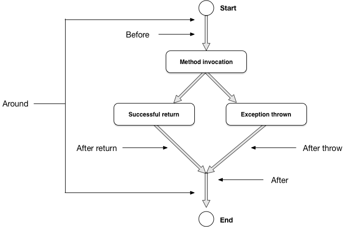

.. index::
   single: Types of advices

Types of advices
================

In aspect oriented programming, pointcut answers on question which operation (method, function, initialization, etc.),
that is, answers on question "**what** do you want to intercept?". On the other hand, advice defines **how**
do you want to intercept, that is, specifies the point of invocation which should be intercepted.

Consider image below. It shows method invocation lifecycle, from its start to end. When method is invoked, the result
of invocation can be either successful (it returns some value, or exists returning nothing, a *void*), or
exception is thrown.

Having in mind a flow and lifecycle of method invocation, aspect oriented programming defines 5 fundamental types of
advices, that is, 5 points of method invocation interception points as shown in image above. You can intercept in any
of those points and execute your arbitrary code.

Depending of used advice, possibility varies, which are explained in following text.

Before advice
~~~~~~~~~~~~~

Advice that executes before a join point, but which does not have the ability to prevent execution flow proceeding to
the join point (unless it throws an exception).

After returning advice
~~~~~~~~~~~~~~~~~~~~~~

Advice to be executed after a join point completes normally: for example, if a method returns without throwing an
exception.

After throwing advice
~~~~~~~~~~~~~~~~~~~~~

Advice to be executed if a method exits by throwing an exception.

After (finally) advice
~~~~~~~~~~~~~~~~~~~~~~

Advice to be executed regardless of the means by which a join point exits (normal or exceptional return).

Around advice
~~~~~~~~~~~~~

Advice that surrounds a join point such as a method invocation. This is the most powerful kind of advice.
Around advice can perform custom behavior before and after the method invocation. It is also responsible for choosing
whether to proceed to the join point or to shortcut the advised method execution by returning its own return value or
throwing an exception.